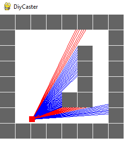
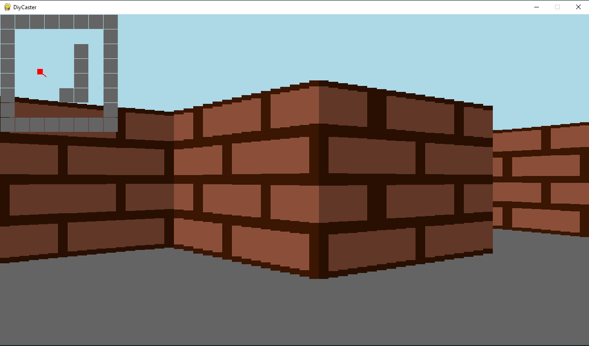

# DiyCaster-v2
  dependencies: python3, pygame
  
  WIP Raycasting engine implemented in pygame. Currently it can project a 2D Array map with textures. I will add support for other entities, floor and roof textures, and maybe someday make an actual game with this

  Images:

  
  