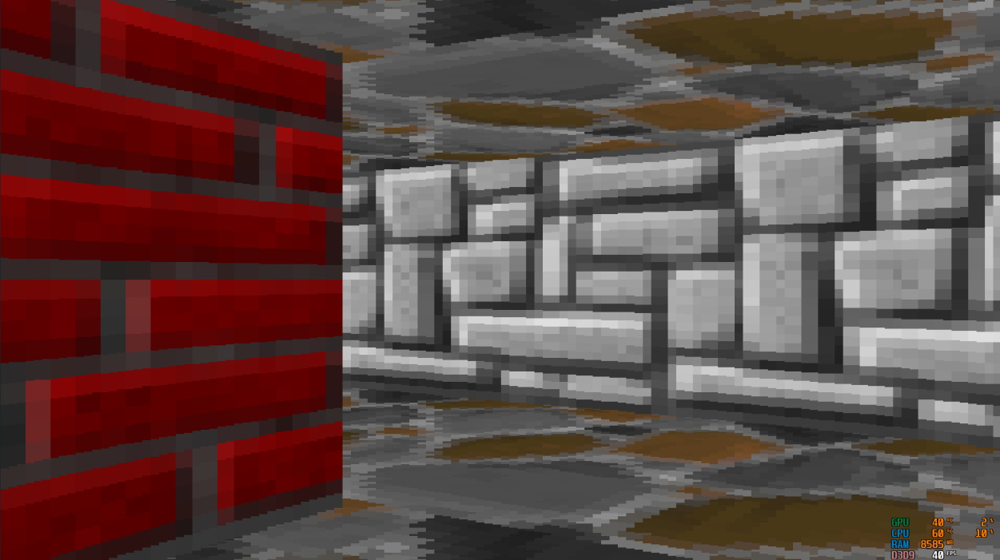

# DiyCaster-v2
  dependencies: python3, pygame
  
  Raycasting engine implemented in pygame

  
  

  
  ## How it works:
  
  Raycasting is a Sudo-3D projection technique used in the early days of 3D games. It works by "casting rays"(below image) outward from a point on a top-down map and drawing lines on the user's window (above image) based on how long a ray travelled before hitting a wall. this technique allows you to create a 3D world using only a 2D map.

  

  ### Rays
  The way these rays are "casted" is actually by casting 2 different rays. one of them checks for horizontal collisions with walls and the other vertical. Each one works by calculating 2 offsets, dx and dy, that can be added to a ray's position to check for collisions with a wall.

  every time dx and dy are added the ray's position is in a new cell of the 2D map which can be used to check for the collision.

  in the image below a ray is checking for collisions with horizontal walls. dy is the size of 1 cell in the 2D world and dx is calculated based on the function 1/tan(angle).
  
  for vertical walls it's the same thing except swapping y and x and using -tan(angle) instead.

  ### 3D Viewport

  

  After casting 120~ rays depending on the player FOV the next part is to display them on the screen. the Width of the screen is divided evenly by the amount of rays casted so each column is a different ray. 
  
  here's how you calculate how much sky, wall, and floor to put on each ray:
  1. multiply the ray's distance by cosine of the difference between the player and ray's angle to remove the fisheye effect
  2. find the wall length. (32 * screenHeight) / newDistance. 32 is the texture resolution, and newDistance is the value found in step 1
  3. to find the length to fill with sky and air with, split the remaining space left in the column evenly between the floor and sky.
  4. Lastly, If you modulo the ray's x and y position as it hit the wall by the texture resolution you can get the corresponding color for any certain part of the wall

  ### Floors
  I kinda just threw code at wall until this worked so.. here's a link that actually explains how the floor casting works
  
  https://wynnliam.github.io/raycaster/news/tutorial/2019/04/09/raycaster-part-03.html#:~:text=Part%201%3A%20Floor%20Casting,a%20floor%20texture%20to%20render.